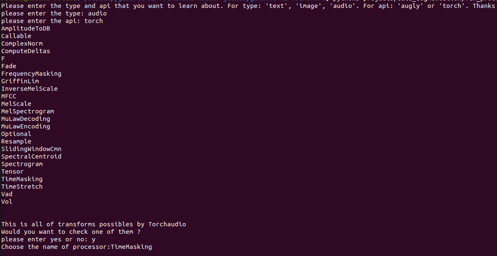

# generic-AI-framework (GAIF)

[MMF](https://github.com/facebookresearch/mmf)

## 1. Prerequisties

GAIF was tested with **Ubuntu 20.04** and python 3.8.10

## 2. Install

```sh
git clone https://github.com/nico-ri/generic-AI-framework
cd generic-AI-framework
pip install --editable .
```

## 3. How to use
For training from scratch vgg16

**Step 1**: create a yaml file *config.yaml* to store the configuration of the training 

```yaml
dataset: classification_cifar10

model_config:
  vgg16:
    model: vgg16
    pretraining: 
      pretrained : False
    losses: 
      - type: cross_entropy
  
optimizer:
  type: Adam
  params:
    lr: 1e-3
    weight_decay: 1e-5

evaluation:
  metrics:
    - accuracy

# trainer lightning
trainer:
  params:
    gpus: 1
    max_epochs: 100
    logger: true
    progress_bar_refresh_rate: 1
    val_check_interval: 100
    checkpoint_callback: true

training:
  trainer: lightning
  seed: 1
  batch_size: 32
  max_epochs: 100
  tensorboard: false
```

**Step 2**: Create a python file *train.py* to run the training

```python
from mmf_cli.run import run
from mmf.common.registry import registry
from gaif.utils.env import setup_imports

setup_imports()

registry.mapping["state"] = {}

opts = [
    "config='PATH_TO/config.yaml'",
    "model=vgg16",
    "dataset=classification_cifar10",
]

run(opts=opts)
```

# Datasets
The job of datasets in our Framework GAIF is taking and sauvegarding all of informations in each dataset and then apply (or not) the different method <Data Augmentation> on them to have a dataset more robuste. Au finale, we could using these data by type and have a visualisation more clearly. 

The Gaif Framework has installed these datasets below for testing:
| Name_Dataset | Type | THEME | Key_Word_Registry | Download | Description |
| ---- | --- | ---- | --- | ---- | ---- |
| [**YahooAnswers**](https://paperswithcode.com/sota/text-classification-on-yahoo-answers) | TEXT | Classification | classification_yahooanswers | :heavy_check_mark: | A dataset with Question and Answers in 10 Types Topic |
| [**IMDB**](https://paperswithcode.com/dataset/imdb-movie-reviews) | TEXT | Classification | classification_imdb | :heavy_check_mark: | A dataset with critics positive and negative for movies | 
| [**Balloon**](https://github.com/matterport/Mask_RCNN) | IMAGE | Detection | classification_balloon | :heavy_check_mark: | A dataset of photos with a lot of balloon to find out |
| [**Poc_mons**](/Poc_mons.md) | IMAGE | Detection | classification_poc_mons | :x: | A dataset prive of photos in Mons to look for mans and vehicules |
| [**Cifar10**](https://paperswithcode.com/dataset/cifar-10) | IMAGE | Classification | classification_cifar10 | :heavy_check_mark: | A dataset with 10 differents category objects |
| [**Omniglot**](https://paperswithcode.com/dataset/omniglot-1) | IMAGE | Classification | classification_omniglot | :heavy_check_mark: | A dataset of hand-written characters with 1623 characters and 20 examples for each character |
| [**Gtzan**](https://paperswithcode.com/dataset/gtzan) | Audio | Classification | classification_gtzan | :heavy_check_mark: | A dataset in Musical genre classification of audio signals |

Besides these datasets, we could also take a look of datasets in MMF, Torchvision, TorchText and Torchaudio. Obviously, MMF is the principal API that we use in our framework, we could simply use the dataset's Key_Word registed by MMF and start to build a modele custom or directly a modele of MMF. On the contrary, we need necessaily to have 3 file: Builder, Dataset and Config correpondant. 

## Usage
Before look at this section <strong>Usage</strong>, we should know that all of datasets except MMF should be registed in our Framework Gaif. To realize that, we should add a commande for each class of builder, for example:
```
@registry.register_builder("classification_yahooanswers")
class YAHOOANSWERSBuilder(BaseDatasetBuilder): 
....
```
Then, Gaif will know the key_word *classification_yahooanswers* correspond to which class and the function *config_path* will tell Gaif where could find your file config.yaml for your parameters like that:
``` 
@classmethod
    def config_path(cls):
        return "configs/datasets/yahooanswers/classification.yaml"
```

### MMF
  For MMF, it provides a few datasets disponible and registed in our Framework GAIF. We give an example here:
  ```
    from mmf.utils.build import build_dataset
    from gaif.utils.env import setup_imports
    from mmf.common.registry import registry
    
    setup_imports()

    dataset_key = "coco"
    dataset = build_dataset(dataset_key=dataset_key)
    print(dataset.__getitem__(6))
  
  ```
  With a key_word of dataset, we could directly use the dataset of MMF without builder and dataset if this dataset is downloadable. For more informations, please look at this : [*MMF_Dataset*](https://github.com/facebookresearch/mmf/tree/master/mmf/datasets/builders)

### Torchvision
  For Torchvision, also Torchtext and Torchaudion, we could use directly their datasets given, but we should also creer two file Builder and Dataset for them. Here is an example: 
  ```
    ... in Builder:
    
    def load(self, config, dataset, *args, **kwargs):
        # Load the dataset using the CIFAR10Dataset class
        self.dataset = ClassificationOMNIGLOTDataset(
            config, dataset, data_folder=self.data_folder
        )
        return self.dataset
        
    ... in Dataset:
    
    def _load(self):
        # Background and Download is optional
        self.omniglot_dataset = torchvision.datasets.Omniglot(
            self._data_dir, background=True, download=True
        )
    
    .... in Config.yaml:
    
    dataset_config:
    # You can specify any attributes you want, and you will get them as attributes
    # inside the config passed to the dataset. Check the Dataset implementation below.
    classification_yahooanswers:
        # Where your data is stored
        data_dir: ${env.data_dir}
        processors:
        
    .... 
    
  ```
In this case, we have to add the Torchvision's dataset to our Framework, then we could apply our processors on these datasets. *Notice that*: the key_word has been used also in config.yaml for distinguishing.

# Processors

The processors are used in dataset for data augmentation and pre-prepare dataset. All of transforms in Augly, Torchvision, Torchtext, Torchaudio could be added by choosing their function's name to config file choosing thses three processors defined by GAIF: *augly_image_transforms*, *augly_audio_transforms*, *augly_text_transforms* . Here is an example: 

  ```
    ... in .yaml
    
    dataset_config:
    # You can specify any attributes you want, and you will get them as attributes
    # inside the config passed to the dataset. Check the Dataset implementation below.
    classification_cifar10_augly:
        # Where your data is stored
        data_dir: ${env.data_dir}
        processors:
        # The processors will be assigned to the datasets automatically by GAIF
        # For example if key is text_processor, you can access that processor inside
        # dataset object using self.text_processor
          augly_image_transforms:
            type: augly_image_transforms
            params: 
              transforms:
                - type: Brightness (Augly)
                  params: 
                    factor: 0.5
                - type: RandomBlur (Augly)
                - ToTensor (Torchvision)


  ```
If we want to have a specifique processor or to use processors at a different moment, we could also change a method to define processors. 
For example:
  ```
    ... in . yaml
    
    dataset_config:
    # You can specify any attributes you want, and you will get them as attributes
    # inside the config passed to the dataset. Check the Dataset implementation below.
    classification_yahooanswers:
        # Where your data is stored
        data_dir: ${env.data_dir}
        processors:
        # The processors will be assigned to the datasets automatically by MMF
        # For example if key is text_processor, you can access that processor inside
        # dataset object using self.text_processor
          augly_text_transforms:
            type: augly_text_transforms
            params: 
              transforms:
                # - type: ReplaceBidirectional
                #   params: 
                #       p: 1.0
                - type: ReplaceSimilarUnicodeChars
                  params:
                    aug_word_p: 0.6
                - type: InsertPunctuationChars
                  params: 
                    {}
          text_processor:
                type: vocab
                params:
                    max_length: 10
                    vocab:
                        type: random
                        vocab_file: yahoo_answers_csv/words.txt


  ```
Also, MMF have proposed serveral processors in differents case, for more informations, please look at here: [MMF_Processors](https://github.com/facebookresearch/mmf/tree/master/mmf/datasets/processors)

If you want to see all of transforms disponbible, we provide 2 solutions:
  - Use this commande to find out it:
  ```
    python projects/data_augmentation/run_processors.py
  ```
  
  - Or look at these two lien for more informations: [Augly_transforme](https://github.com/facebookresearch/AugLy) and [Torch_transforme](https://pytorch.org/vision/stable/transforms.html)
  
For going far, we have provided a notebook for dataset custom, dataset exterieur, etc. 
If you want and need it, take a look at here: [Dataset_Detail](/Dataset_Example.ipynb)


## Models and Backbones

* [timm](https://github.com/rwightman/pytorch-image-models)
* [torchvision](https://pytorch.org/vision/stable/models.html)
* [torchaudio](https://pytorch.org/audio/stable/models.html) (not tested yet)
* [transformers](https://huggingface.co/transformers/main_classes/model.html) (not implemented yet)
* [EfficientNet](https://github.com/lukemelas/EfficientNet-PyTorch)
## FPN Backbones 

## Weights
* [CIFAR-10/CIFAR-100](https://github.com/chenyaofo/pytorch-cifar-models) (supervised)
* [Places 365](https://github.com/CSAILVision/places365) (supervised)
* [lightly](https://github.com/lightly-ai/lightly) (self-supervised) (Not implemented yet)


## Trainer

The trainer in GAIF is based on the trainer of pytorch-lightning 

* self-supervised : [lightly](https://github.com/lightly-ai/lightly)
* distillation: 

Extensions like deepspeed will be available.

## License
## Citations
GAIF use API of 
* models:
[timm](https://github.com/rwightman/pytorch-image-models), 
[torchvision](https://pytorch.org/vision/0.8/index.html), 
[torchaudio](https://pytorch.org/audio/stable/index.html),
[transformers](https://huggingface.co/transformers/)

* weights:
[pytorch-cifar-models](https://github.com/chenyaofo/pytorch-cifar-models)
* training: 
[lightly](https://github.com/lightly-ai/lightly)

Authors of MMF
```bibtex
@misc{singh2020mmf,
  author =       {Singh, Amanpreet and Goswami, Vedanuj and Natarajan, Vivek and Jiang, Yu and Chen, Xinlei and Shah, Meet and
                 Rohrbach, Marcus and Batra, Dhruv and Parikh, Devi},
  title =        {MMF: A multimodal framework for vision and language research},
  howpublished = {\url{https://github.com/facebookresearch/mmf}},
  year =         {2020}
}
```

``` 
    @misc{bitton2021augly,
    author       = {Joanna Bitton and Zoe Papakipos},
    title        = {AugLy: A data augmentations library for audio, image, text, and video.},
    year         = {2021},
    howpublished = {\url{https://github.com/facebookresearch/AugLy}},
    doi          = {10.5281/zenodo.5014032}
    }
```
