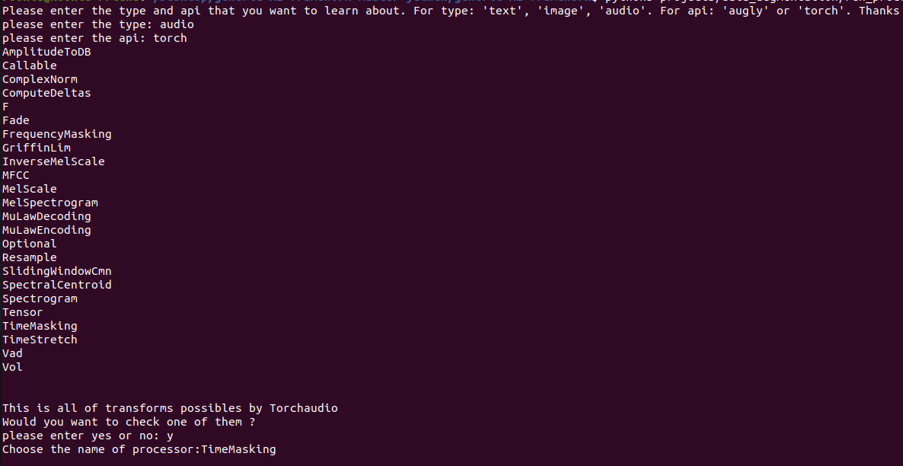

# generic-AI-framework (GAIF)

[MMF](https://github.com/facebookresearch/mmf)

## 1. Prerequisties

GAIF was tested with **Ubuntu 20.04** and python 3.8.10

Here are Requirements for Installing:

```text
mmf @ git+https://github.com/facebookresearch/mmf@d37fffc
torch==1.9.0
torchvision== 0.10.0 
torchaudio==0.9.0
pytorch_lightning>=1.3.1
torchinfo==0.1.1
einops==0.3.0
timm>=0.4.9
efficientnet_pytorch==0.7.1
tqdm>=4.43.0,<4.50.0
numpy>=1.16.6
opencv-python==4.2.0.32
matplotlib==3.3.4
wget==3.2
scikit-learn==0.24.2
Pillow>=8.2.0
gdown==3.13.0
lightly==1.1.15
ranger21 @ git+https://github.com/lessw2020/Ranger21@57add4c
augly==0.1.6 
torchtext==0.5.0
spacy==3.1.0

```

## 2. Install

```sh
git clone https://github.com/nico-ri/generic-AI-framework
cd generic-AI-framework
pip install --editable .
```

## 3. How to use
For training from scratch vgg16

**Step 1**: create a yaml file *config.yaml* to store the configuration of the training 

```yaml
dataset: classification_cifar10

model_config:
  vgg16:
    model: vgg16
    pretraining: 
      pretrained : False
    losses: 
      - type: cross_entropy
  
optimizer:
  type: Adam
  params:
    lr: 1e-3
    weight_decay: 1e-5

evaluation:
  metrics:
    - accuracy

# trainer lightning
trainer:
  params:
    gpus: 1
    max_epochs: 100
    logger: true
    progress_bar_refresh_rate: 1
    val_check_interval: 100
    checkpoint_callback: true

training:
  trainer: lightning
  seed: 1
  batch_size: 32
  max_epochs: 100
  tensorboard: false
```

**Step 2**: Create a python file *train.py* to run the training

```python
from mmf_cli.run import run
from mmf.common.registry import registry
from gaif.utils.env import setup_imports

setup_imports()

registry.mapping["state"] = {}

opts = [
    "config='PATH_TO/config.yaml'",
    "model=vgg16",
    "dataset=classification_cifar10",
]

run(opts=opts)
```

## [4.Datasets](./doc/Dataset_README.md)
Inside our GAIF framework, the dataset part is mainly loaded with various types of data, such as COCO, Yolo, etc., to facilitate the extraction of needed information and tags. And GAIF provides different methods of **Data Augmentation** to make the dataset more complete. Of course, we also provide the function of visualizing the dataset samples to facilitate a more intuitive understanding of this type of data.

A number of datasets have been installed for testing and experience with the GAIF framework, as listed below:
| Name_Dataset | Type | THEME | Key_Word_Registry | Download | Description |
| ---- | --- | ---- | --- | ---- | ---- |
| [**YahooAnswers**](https://paperswithcode.com/sota/text-classification-on-yahoo-answers) | TEXT | Classification | classification_yahooanswers | :heavy_check_mark: | A dataset with Question and Answers in 10 Types Topic |
| [**IMDB**](https://paperswithcode.com/dataset/imdb-movie-reviews) | TEXT | Classification | classification_imdb | :heavy_check_mark: | A dataset with critics positive and negative for movies | 
| [**Balloon**](https://github.com/matterport/Mask_RCNN) | IMAGE | Detection | detection_balloon | :heavy_check_mark: | A dataset of photos with a lot of balloon to find out |
| [**Poc_mons**](./doc/Poc_mons.md) | IMAGE | Detection | detection_poc_mons | :x: | A dataset prive of photos in Mons to look for mans and vehicules |
| [**Cifar10**](https://paperswithcode.com/dataset/cifar-10) | IMAGE | Classification | classification_cifar10 | :heavy_check_mark: | A dataset with 10 differents category objects |
| [**Omniglot**](https://paperswithcode.com/dataset/omniglot-1) | IMAGE | Classification | classification_omniglot | :heavy_check_mark: | A dataset of hand-written characters with 1623 characters and 20 examples for each character |
| [**Gtzan**](https://paperswithcode.com/dataset/gtzan) | Audio | Classification | classification_gtzan | :heavy_check_mark: | A dataset in Musical genre classification of audio signals |

In addition to the above datasets, we can also find the required datasets from MMF, Torchvision, Torchtext and Torchaudio. MMF, as the main API of our framework, we have all the datasets recorded in the registry and just need to load the key_word of this required dataset by a simple script. For the other three APIs, including custom datasets need to create a special Builder and Dataset, and create a key_word private saved into the registry. Of course, all datasets require the configuration file .yaml to provide the required parameters. There will be specific examples in the Usage Section.

### Usage
As mentioned in the previous section, all datasets except MMF need to create a key_word and save it in the registry of GAIF framework. For example:
```python
@registry.register_builder("classification_yahooanswers")
class YAHOOANSWERSBuilder(BaseDatasetBuilder): 
....
```
Then, the GAIF framework will know that this key_word *classification_yahooanswers* is the class of the corresponding dataset and thus create the relevant object. Also, there is a function *config_path* (custom) in the Builder, which will provide the location of the dataset configuration file.yaml, so that GAIF can find the relevant parameters. Something like this:
``` python
@classmethod
    def config_path(cls):
        return "configs/datasets/yahooanswers/classification.yaml"
```

#### MMF
  For MMF, it provides a number of datasets that can be used directly, including automatically downloaded data, and are registed in the GAIF framework. We give an example here:
```python
    from mmf.utils.build import build_dataset
    from gaif.utils.env import setup_imports
    from mmf.common.registry import registry
    
    setup_imports()

    dataset_key = "coco"
    dataset = build_dataset(dataset_key=dataset_key)
    print(dataset.__getitem__(6))
```
  The samples of this dataset are obtained directly by calling MMF's Builder and Dataset with the key_word of the MMF dataset. For more informations, please look at this : 
  - [*MMF_Dataset*](https://github.com/facebookresearch/mmf/tree/master/mmf/datasets/builders)
  - [*MMF_Colab*](https://colab.research.google.com/github/facebookresearch/mmf/blob/notebooks/notebooks/kdd_tutorial.ipynb#scrollTo=wu5o2DbhHp8M)

#### Torchvision
  For the three sisters of the Torch series, we can use the datasets they generate directly, but we have to build Builders and Datasets for them separately, as described in the previous section. Here is an example: 
```python
    ... in Builder:
    
    def load(self, config, dataset, *args, **kwargs):
        # Load the dataset using the CIFAR10Dataset class
        self.dataset = ClassificationOMNIGLOTDataset(
            config, dataset, data_folder=self.data_folder
        )
        return self.dataset
        
    ... in Dataset:
    
    def _load(self):
        # Background and Download is optional
        self.omniglot_dataset = torchvision.datasets.Omniglot(
            self._data_dir, background=True, download=True
        )
    
    .... in Config.yaml:
    
    dataset_config:
    # You can specify any attributes you want, and you will get them as attributes
    # inside the config passed to the dataset. Check the Dataset implementation below.
    classification_yahooanswers:
        # Where your data is stored
        data_dir: ${env.data_dir}
        processors:
        
    .... 
    
```
In the example above, Torchvision provides a dataset class for Omniglot. We need to create the Builder, Dataset and profile.yaml for them separately.  *Notice*: The key_word in the configuration file and the key_word of the dataset should be consistent.

Finally, we can arrange where the datasets are stored by changing the env.data_dir. Generally, the default is to store it in **".cache/torch/mmf/data"**.


## [5.Processors](./doc/Proc_README.md)

Processors are generally used in the GAIF framework to implement various Data Augmentation and to tersorize data from datasets. But there are also some special Processor, such as TextProcessor, can be used to tokenize text data and build vocab dictionary. 
<p>With the GAIF framework's three custom processors: <strong>augly_image_transforms</strong>, <strong>augly_audio_transforms</strong>, <strong>augly_text_transforms</strong> , GAIF can add all transforms function of the augly and the torch series.
<p>The processors will implement the required Data Augmentation by simply adding the name of the transforms and the required parameters to the config. Here is an example: 

```yaml
    
    dataset_config:
    # You can specify any attributes you want, and you will get them as attributes
    # inside the config passed to the dataset. Check the Dataset implementation below.
    classification_cifar10_augly:
        # Where your data is stored
        data_dir: ${env.data_dir}
        processors:
        # The processors will be assigned to the datasets automatically by GAIF
        # For example if key is text_processor, you can access that processor inside
        # dataset object using self.text_processor
          augly_image_transforms:
            type: augly_image_transforms
            params: 
              transforms:
                - type: Brightness (Augly)
                  params: 
                    factor: 0.5
                - type: RandomBlur (Augly)
                - ToTensor (Torchvision)


```
Of course, in addition to Data Augmentation, we can also use some special processors, such as some of MMF's processors or custom processors, or use multiple processors at the same time.
For example:
```yaml
    
    dataset_config:
    # You can specify any attributes you want, and you will get them as attributes
    # inside the config passed to the dataset. Check the Dataset implementation below.
    classification_yahooanswers:
        # Where your data is stored
        data_dir: ${env.data_dir}
        processors:
        # The processors will be assigned to the datasets automatically by MMF
        # For example if key is text_processor, you can access that processor inside
        # dataset object using self.text_processor
          augly_text_transforms:
            type: augly_text_transforms
            params: 
              transforms:
                # - type: ReplaceBidirectional
                #   params: 
                #       p: 1.0
                - type: ReplaceSimilarUnicodeChars
                  params:
                    aug_word_p: 0.6
                - type: InsertPunctuationChars
                  params: 
                    {}
          text_processor:
                type: vocab
                params:
                    max_length: 10
                    vocab:
                        type: random
                        vocab_file: yahoo_answers_csv/words.txt
```
For more information about MMF's processors and their uses, please click here: [MMF_Processors](https://github.com/facebookresearch/mmf/tree/master/mmf/datasets/processors)

If you want to see all valid transforms, We offer two approaches:
  - Use this custom commande to find out it:
  ```sh
    python projects/data_augmentation/run_processors.py
  ```
  
  - Or look at these two lien for more informations: [Augly_transforme](https://github.com/facebookresearch/AugLy) and [Torch_transforme](https://pytorch.org/vision/stable/transforms.html)
  
For those who wish to learn more about the dataset part of the GAIF framework or have unanswered questions, we have a notebook that shows the process of building a custom dataset from start to finish. Please look at here: [Dataset_Detail](/Dataset_Example.ipynb)


## Models and Backbones

* [timm](https://github.com/rwightman/pytorch-image-models)
* [torchvision](https://pytorch.org/vision/stable/models.html)
* [torchaudio](https://pytorch.org/audio/stable/models.html) (not tested yet)
* [transformers](https://huggingface.co/transformers/main_classes/model.html) (not implemented yet)
* [EfficientNet](https://github.com/lukemelas/EfficientNet-PyTorch)
## FPN Backbones 

## Weights
* [CIFAR-10/CIFAR-100](https://github.com/chenyaofo/pytorch-cifar-models) (supervised)
* [Places 365](https://github.com/CSAILVision/places365) (supervised)
* [lightly](https://github.com/lightly-ai/lightly) (self-supervised) (Not implemented yet)


## Trainer

The trainer in GAIF is based on the trainer of pytorch-lightning 

* self-supervised : [lightly](https://github.com/lightly-ai/lightly)
* distillation: 

Extensions like deepspeed will be available.

## License
## Citations
GAIF use API of 
* models:
[timm](https://github.com/rwightman/pytorch-image-models), 
[torchvision](https://pytorch.org/vision/0.8/index.html), 
[torchaudio](https://pytorch.org/audio/stable/index.html),
[transformers](https://huggingface.co/transformers/)

* weights:
[pytorch-cifar-models](https://github.com/chenyaofo/pytorch-cifar-models)
* training: 
[lightly](https://github.com/lightly-ai/lightly)

Authors of MMF
```bibtex
@misc{singh2020mmf,
  author =       {Singh, Amanpreet and Goswami, Vedanuj and Natarajan, Vivek and Jiang, Yu and Chen, Xinlei and Shah, Meet and
                 Rohrbach, Marcus and Batra, Dhruv and Parikh, Devi},
  title =        {MMF: A multimodal framework for vision and language research},
  howpublished = {\url{https://github.com/facebookresearch/mmf}},
  year =         {2020}
}
```

Authors of Augly
``` bibtex
@misc{bitton2021augly,
    author       = {Joanna Bitton and Zoe Papakipos},
    title        = {AugLy: A data augmentations library for audio, image, text, and video.},
    year         = {2021},
    howpublished = {\url{https://github.com/facebookresearch/AugLy}},
    doi          = {10.5281/zenodo.5014032}
    }
```
